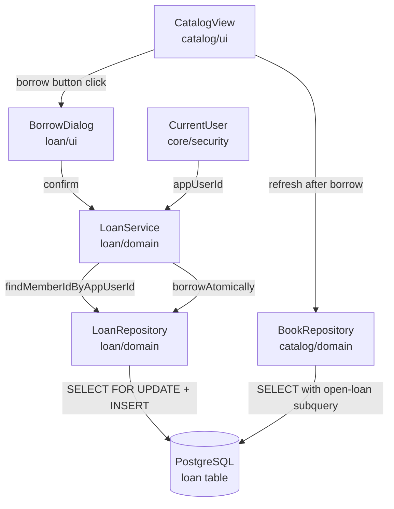

# Design Document: UC-002 Borrow Book

## Overview

UC-002 Borrow Book lets a signed-in member (or a librarian who also holds a member row)
borrow an available copy of a book from the catalog view. The feature adds a `LoanService`,
a `LoanRepository`, and a `BorrowDialog` in a new `loan` package. It also adds a Borrow
button column to the existing `CatalogView` grid.

The key design constraint is **atomicity**: the availability check and the loan insertion
must be a single indivisible database step so that concurrent requests can never together
create more open loans than `book.copies`. This is achieved with a `SELECT ... FOR UPDATE`
on the book row inside a Spring `@Transactional` method, which serialises concurrent
borrows at the database level.

---

## Architecture



`CatalogView` is the entry point. It already holds the `BookRepository` reference and the
`refresh()` method that reloads availability. Adding `LoanService` as a second dependency
keeps the view in control of the post-borrow refresh without introducing a circular
dependency between packages — `loan/domain` never imports `catalog`.

---

## Components and Interfaces

### Package layout

```
ai.unified.process.demo.book.library
└── loan/
    ├── domain/
    │   ├── package-info.java
    │   ├── Loan.java                 # domain record
    │   ├── LoanRepository.java       # data access
    │   ├── LoanService.java          # borrow orchestration
    │   ├── NoAvailableCopyException.java
    │   └── NoMemberProfileException.java
    └── ui/
        ├── package-info.java
        └── BorrowDialog.java         # ConfirmDialog wrapper
```

`CatalogView` gains a constructor parameter (`LoanService`) and a new component column.
No other existing file changes.

---

### `Loan` domain record

```java
package ai.unified.process.demo.book.library.loan.domain;

import org.jspecify.annotations.Nullable;
import java.time.LocalDateTime;

/**
 * A single borrow event as returned by {@link LoanRepository}.
 *
 * @param memberId the {@code member.id} of the borrowing patron (never app_user.id)
 * @param bookId the borrowed book
 * @param borrowedAt timestamp when the copy was taken out
 * @param returnedAt null while the copy is still on loan; set when returned (C-019)
 */
public record Loan(Long id, Long memberId, Long bookId, LocalDateTime borrowedAt,
        @Nullable LocalDateTime returnedAt) {
}
```

---

### `LoanRepository`

```java
package ai.unified.process.demo.book.library.loan.domain;

import org.jooq.DSLContext;
import org.jspecify.annotations.Nullable;
import org.springframework.stereotype.Repository;

import static ai.unified.process.demo.book.library.db.Tables.BOOK;
import static ai.unified.process.demo.book.library.db.Tables.LOAN;
import static ai.unified.process.demo.book.library.db.Tables.MEMBER;

/**
 * Data-access methods for UC-002 Borrow Book.
 * <p>
 * {@link #borrowAtomically(long, long)} is the core method: it locks the book row,
 * re-checks availability, and inserts the loan row in one transaction step (BR-009).
 * The caller ({@link LoanService}) must invoke it inside a Spring {@code @Transactional}
 * method so the lock is released on commit.
 */
@Repository
public class LoanRepository {

    private final DSLContext dsl;

    public LoanRepository(DSLContext dsl) {
        this.dsl = dsl;
    }

    /**
     * Returns the {@code member.id} linked to the given {@code app_user.id}, or
     * {@code null} when the user has no member row (alternative flow A2, BR-010).
     *
     * @param appUserId the {@code app_user.id} of the signed-in user
     * @return the patron's {@code member.id}, or {@code null}
     */
    public @Nullable Long findMemberIdByAppUserId(long appUserId) {
        return dsl.select(MEMBER.ID)
                .from(MEMBER)
                .where(MEMBER.USER_ID.eq(appUserId))
                .fetchOne(MEMBER.ID);
    }

    /**
     * Locks the book row, re-checks that at least one copy is available, and inserts a
     * new loan row — all as one atomic step inside the caller's transaction (BR-009).
     * <p>
     * Returns {@code true} when the loan was created, {@code false} when the book was
     * fully on loan at the moment of the lock (alternative flow A1). The caller translates
     * {@code false} into a {@link NoAvailableCopyException}.
     * <p>
     * SQL outline:
     * <pre>{@code
     * SELECT copies FROM book WHERE id = :bookId FOR UPDATE;
     * -- then in Java: if (copies - openLoans > 0) INSERT INTO loan ...
     * }</pre>
     *
     * @param memberId the patron's {@code member.id}
     * @param bookId the book to borrow
     * @return {@code true} if the loan was inserted; {@code false} if no copy was free
     */
    public boolean borrowAtomically(long memberId, long bookId) {
        // Lock the book row to serialise concurrent borrows (BR-009).
        Integer copies = dsl.select(BOOK.COPIES)
                .from(BOOK)
                .where(BOOK.ID.eq(bookId))
                .forUpdate()
                .fetchOne(BOOK.COPIES);

        if (copies == null) {
            return false;
        }

        int openLoans = dsl.fetchCount(LOAN, LOAN.BOOK_ID.eq(bookId).and(LOAN.RETURNED_AT.isNull()));

        if (openLoans >= copies) {
            return false;
        }

        dsl.insertInto(LOAN, LOAN.MEMBER_ID, LOAN.BOOK_ID)
                .values(memberId, bookId)
                .execute();

        return true;
    }
}
```

> **Why `SELECT FOR UPDATE` rather than a database constraint?**  
> The loan table has no stored `available_copies` column to put a CHECK on (C-018).
> A unique partial index cannot express "count ≤ copies". `SELECT FOR UPDATE` on the
> book row is the standard PostgreSQL pattern for this shape of invariant: lock the
> row that holds the upper bound, recount below it, then insert. The transaction
> commits and releases the lock atomically; any concurrent request that arrives while
> the lock is held will block and then re-read the updated open-loan count.

---

### `LoanService`

```java
package ai.unified.process.demo.book.library.loan.domain;

import ai.unified.process.demo.book.library.core.security.CurrentUser;
import org.springframework.stereotype.Service;
import org.springframework.transaction.annotation.Transactional;

/**
 * Orchestrates the borrow action for UC-002.
 * <p>
 * This service exists because borrowing spans two entities ({@code member} and
 * {@code loan}) and enforces an availability invariant that must be checked atomically
 * (BR-009). The view must go through this service exclusively and must not call
 * {@link LoanRepository} directly.
 */
@Service
public class LoanService {

    private final LoanRepository loanRepository;

    private final CurrentUser currentUser;

    public LoanService(LoanRepository loanRepository, CurrentUser currentUser) {
        this.loanRepository = loanRepository;
        this.currentUser = currentUser;
    }

    /**
     * Borrows a copy of the given book for the currently signed-in user (UC-002 main
     * success scenario).
     * <p>
     * The method:
     * <ol>
     * <li>Resolves the signed-in {@code app_user.id} via {@link CurrentUser}.</li>
     * <li>Looks up the corresponding {@code member.id} (BR-010, C-009).</li>
     * <li>Delegates to {@link LoanRepository#borrowAtomically(long, long)}, which locks
     * the book row and inserts the loan in one step (BR-009).</li>
     * </ol>
     *
     * @param bookId the {@code book.id} to borrow
     * @throws NoMemberProfileException if the signed-in user has no linked member row
     *     (alternative flow A2)
     * @throws NoAvailableCopyException if no copy is free at the moment of the request
     *     (alternative flow A1, A3)
     */
    @Transactional
    public void borrow(long bookId) {
        long appUserId = currentUser.requireAppUserId();

        Long memberId = loanRepository.findMemberIdByAppUserId(appUserId);
        if (memberId == null) {
            throw new NoMemberProfileException(appUserId);
        }

        boolean created = loanRepository.borrowAtomically(memberId, bookId);
        if (!created) {
            throw new NoAvailableCopyException(bookId);
        }
    }
}
```

---

### Exception types

```java
// loan/domain/NoMemberProfileException.java
package ai.unified.process.demo.book.library.loan.domain;

/**
 * Thrown by {@link LoanService#borrow(long)} when the signed-in user has no linked
 * {@code member} row (alternative flow A2, BR-010, C-009).
 */
public class NoMemberProfileException extends RuntimeException {

    public NoMemberProfileException(long appUserId) {
        super("No member profile linked to app_user.id=" + appUserId);
    }
}
```

```java
// loan/domain/NoAvailableCopyException.java
package ai.unified.process.demo.book.library.loan.domain;

/**
 * Thrown by {@link LoanService#borrow(long)} when all copies of a book are on loan at
 * the moment of the request (alternative flow A1, BR-009, C-014).
 */
public class NoAvailableCopyException extends RuntimeException {

    public NoAvailableCopyException(long bookId) {
        super("No available copy for book.id=" + bookId);
    }
}
```

---

### `BorrowDialog`

A thin `ConfirmDialog` wrapper opened by the catalog row button. It holds the book title
for the confirmation message and calls `LoanService` on confirm.

```java
package ai.unified.process.demo.book.library.loan.ui;

import ai.unified.process.demo.book.library.loan.domain.LoanService;
import ai.unified.process.demo.book.library.loan.domain.NoAvailableCopyException;
import ai.unified.process.demo.book.library.loan.domain.NoMemberProfileException;
import com.vaadin.flow.component.confirmdialog.ConfirmDialog;
import com.vaadin.flow.component.notification.Notification;
import com.vaadin.flow.component.notification.NotificationVariant;

/**
 * Confirmation dialog for UC-002 Borrow Book.
 * <p>
 * Opened from {@code CatalogView} when the member clicks the Borrow button on a row.
 * On confirm it calls {@link LoanService#borrow(long)} and shows a Vaadin notification
 * toast — success or failure (BR-011, alternative flows A1 and A2).
 * After a successful borrow it calls the supplied {@code onSuccess} callback so
 * {@code CatalogView} can refresh its grid without the dialog needing to know about it.
 */
public class BorrowDialog extends ConfirmDialog {

    public BorrowDialog(long bookId, String title, LoanService loanService, Runnable onSuccess) {
        setHeader("Borrow \"" + title + "\"?");
        setText("Borrow this book and record the loan against your account?");
        setConfirmText("Borrow");
        setCancelable(true);

        addConfirmListener(event -> {
            try {
                loanService.borrow(bookId);
                Notification.show("\"" + title + "\" borrowed successfully.")
                        .addThemeVariants(NotificationVariant.LUMO_SUCCESS);
                onSuccess.run();
            }
            catch (NoAvailableCopyException ex) {
                Notification.show("No copy of \"" + title + "\" is available right now.")
                        .addThemeVariants(NotificationVariant.LUMO_ERROR);
            }
            catch (NoMemberProfileException ex) {
                Notification.show("Borrowing is not available for your account.")
                        .addThemeVariants(NotificationVariant.LUMO_ERROR);
            }
        });
    }
}
```

---

### Changes to `CatalogView`

Add `LoanService` as a second constructor parameter, add a Borrow button column to the
grid, and pass `this::refresh` as the success callback.

```java
// New field
private final transient LoanService loanService;

// Updated constructor signature
public CatalogView(BookRepository bookRepository, LoanService loanService) {
    this.bookRepository = bookRepository;
    this.loanService = loanService;
    // ... existing setup ...
    configureBorrowColumn();
    // ...
}

// New column — called inside the constructor after configureGrid()
private void configureBorrowColumn() {
    grid.addComponentColumn(book -> {
        if (book.availableCopies() <= 0) {
            return new Span(); // empty cell for unavailable books
        }
        var button = new Button("Borrow");
        button.addThemeVariants(ButtonVariant.LUMO_PRIMARY, ButtonVariant.LUMO_SMALL);
        button.addClickListener(event -> {
            var dialog = new BorrowDialog(book.id(), book.title(), loanService, this::refresh);
            dialog.open();
        });
        return button;
    }).setHeader("").setAutoWidth(true).setFlexGrow(0);
}
```

> `refresh()` is `private` in `CatalogView`; `this::refresh` works as a method reference within the class regardless, so no visibility change is needed.

> **Design note — Borrow button visibility for unavailable books.**  
> The button is hidden (empty cell) when `availableCopies <= 0`. This is a UX choice: the
> member already sees BR-008 emphasis on the availability cell; offering a Borrow button
> that would immediately fail adds no value. The service still enforces BR-009 for any
> request that reaches it (e.g. a race where availability drops between page load and
> click).

---

### `package-info.java` stubs

```java
// loan/domain/package-info.java
/**
 * Domain layer for UC-002 Borrow Book: {@link LoanRepository}, {@link LoanService},
 * and the {@link Loan} record.
 */
@NullMarked
package ai.unified.process.demo.book.library.loan.domain;

import org.jspecify.annotations.NullMarked;
```

```java
// loan/ui/package-info.java
/**
 * UI layer for UC-002 Borrow Book: {@link BorrowDialog}.
 */
@NullMarked
package ai.unified.process.demo.book.library.loan.ui;

import org.jspecify.annotations.NullMarked;
```

---

## Data Models

No new Flyway migration is required. The `loan` table (V004), `member` table (V002), and
`book` table (V001) already contain all the columns needed:

| Column | Table | Used by UC-002 |
|--------|-------|----------------|
| `book.copies` | book | upper bound for availability check |
| `loan.member_id` | loan | FK → member.id for new loan row |
| `loan.book_id` | loan | FK → book.id for new loan row |
| `loan.borrowed_at` | loan | `DEFAULT CURRENT_TIMESTAMP` — no explicit insert needed |
| `loan.returned_at` | loan | omitted from INSERT so it defaults to null (BR-012) |
| `member.user_id` | member | join to resolve app_user.id → member.id |

> **Why no new migration?**  
> V004 was written with UC-002 in mind: the FK constraints on `member_id` and `book_id`
> deliberately omit `ON DELETE CASCADE`. This prevents a book or member row from being
> deleted while loans reference it, but BR-014 itself is met by a simpler guarantee: no
> application code path deletes loan rows. The `DEFAULT CURRENT_TIMESTAMP` on
> `borrowed_at` means the INSERT does not need to supply that value.
> The CHECK constraint `chk_loan_returned_after_borrowed` is already present. The
> partial index `idx_loan_open_by_book` optimises the open-loan count subquery used in
> both the availability check and the catalog display.
>
> A `CHECK (returned_at IS NULL)` partial unique constraint on `(member_id, book_id)` was
> considered to enforce BR-009 at the database level, but it would violate BR-015 (a
> member may hold multiple open loans for the same book). The `SELECT FOR UPDATE` approach
> in `LoanRepository.borrowAtomically()` is therefore the correct mechanism.

---

## Correctness Properties

*A property is a characteristic or behavior that should hold true across all valid
executions of a system — essentially, a formal statement about what the system should do.
Properties serve as the bridge between human-readable specifications and machine-verifiable
correctness guarantees.*

---

### Property 1: Borrow succeeds exactly when a copy is free

*For any* book with `copies = N` and exactly `M` open loans where `M < N`, a borrow
request from a member with a valid member row SHALL succeed and increase the open-loan
count to `M + 1`.

**Validates: Requirements 1.1, 1.2**

---

### Property 2: Borrow is rejected when no copy is available

*For any* book where the open-loan count equals `book.copies`, a borrow request SHALL be
rejected with `NoAvailableCopyException` and the open-loan count SHALL remain unchanged.

**Validates: Requirements 1.5**

---

### Property 3: Availability is always non-negative

*For any* sequence of concurrent or sequential borrow operations, the derived available-
copy count (`book.copies` − count of open loans) SHALL never be negative, regardless of
the number of concurrent callers.

**Validates: Requirements 1.1, 1.6**

---

## Error Handling

| Condition | Service throws | View shows |
|-----------|---------------|------------|
| Actor has no member row (A2) | `NoMemberProfileException` | Error notification: "Borrowing is not available for your account." |
| No copy available at borrow time (A1) | `NoAvailableCopyException` | Error notification: "No copy of «title» is available right now." |
| Concurrent race — last copy gone (A3) | `NoAvailableCopyException` (same path as A1) | Same error notification as A1 |
| Unexpected runtime exception | Propagates through Spring | Vaadin's default error handler shows a system error page |

The two typed exceptions are unchecked (`RuntimeException` subclasses) so Spring's
`@Transactional` will roll back on them automatically without needing
`rollbackFor` configuration.

`BorrowDialog` catches only the two domain exceptions. Any other exception propagates to
Vaadin's unhandled-exception boundary, which is the right behaviour for unexpected errors.

---

## Testing Strategy

### Browserless unit tests — `UC002BorrowBookTest`

Extends `AbstractBrowserlessTest`. Uses `@WithUserDetails("alice")` for the happy-path
and most scenarios; uses `@WithUserDetails("librarian")` for the A2 (no member row)
scenario.

> **Why `@WithUserDetails` instead of `@WithMockUser`?**  
> `@WithUserDetails` loads the real `AppUserDetails` principal via `AppUserDetailsService`,
> so `CurrentUser.requireAppUserId()` returns the actual seeded `app_user.id`.
> `@WithMockUser` creates a synthetic principal that is not an `AppUserDetails` instance
> and would cause `CurrentUser.requireAppUserId()` to throw.
>
> For the A2 scenario, `@WithUserDetails("librarian")` is used because the librarian
> account is seeded by `SecuritySeed` as LIBRARIAN but has no linked `member` row —
> `DemoDataSeed` only creates a member row for alice.

**Test data isolation:** UC-002 tests create their own books with unique titles (e.g. a
UUID-prefixed title) at the start of each test and delete those book and loan rows in a
`@AfterEach` cleanup. Seeded books and loans are never borrowed, returned, or edited by
UC-002 tests.

| Test method | Scenario | Business rules |
|-------------|----------|---------------|
| `borrow_button_appears_for_available_book()` | Happy path setup | BR-009 |
| `borrow_button_absent_for_unavailable_book()` | A1 pre-check (no button on 0-copy row) | BR-008, BR-009 |
| `successful_borrow_shows_success_notification()` | Main success scenario, step 5 | FR-005 |
| `successful_borrow_updates_availability_in_grid()` | BR-011 — grid refreshes without reload | BR-011 |
| `borrow_unavailable_book_shows_error_notification()` | A1 — no copy available at service level | BR-009 |
| `borrow_without_member_profile_shows_error_notification()` | A2 — no member row | BR-010, C-009 |
| `concurrent_borrow_creates_exactly_one_loan()` | A3 — race condition | BR-009 |
| `loan_row_has_null_returned_at_and_no_due_date()` | BR-012 structural check | BR-012, C-019 |

The test `concurrent_borrow_creates_exactly_one_loan()` inserts a single-copy book at the start. Worker threads call `LoanService.borrow(bookId)` — not `LoanRepository.borrowAtomically()` directly — because calling the repository outside a transaction releases the `FOR UPDATE` lock as soon as the `SELECT` commits, defeating the atomicity guarantee being tested.

Because `LoanService.borrow()` calls `CurrentUser.requireAppUserId()`, each worker thread needs the Spring Security context from the test thread. Before launching threads, capture the context:

```java
SecurityContext ctx = SecurityContextHolder.getContext();
```

Then at the start of each worker's `Runnable`, before the latch `await()`:

```java
SecurityContextHolder.setContext(ctx);
```

A `CountDownLatch` start gate holds all threads until all are ready, then releases them simultaneously. After all threads finish, the test asserts:

- Exactly `min(copies, threads)` loan rows exist for the book.
- Every thread that did not create a loan threw `NoAvailableCopyException` (caught and counted); no other exception is acceptable.
- The open-loan count for the book does not exceed `book.copies`.

> **Atomicity canary:** This test is the canary for two guarantees simultaneously. Removing `SELECT FOR UPDATE` from `LoanRepository.borrowAtomically()` allows concurrent threads to read the same stale availability count before any insert, producing more loans than `book.copies`. Removing `@Transactional` from `LoanService.borrow()` releases the lock between the `SELECT FOR UPDATE` and the `INSERT`, producing the same race. The test must fail in either case.
>
> **Spring Security context propagation:** `SecurityContextHolder` is thread-local by default. Capturing the context on the test thread and calling `SecurityContextHolder.setContext(ctx)` in each worker before the latch gives every worker the same authenticated principal, so `CurrentUser.requireAppUserId()` succeeds inside `LoanService.borrow()`.

The test is run for two cases: `(copies=1, threads=5)` — exactly 1 loan expected, 4 failures — and `(copies=3, threads=5)` — exactly 3 loans expected, 2 failures.

### Parameterised tests — `UC002BorrowBookParameterizedTest`

Extends `AbstractBrowserlessTest`. Uses `@WithUserDetails("alice")`. Each test inserts a
book with a UUID-prefixed title and deletes it (and any loans) in `@AfterEach`.

**Property 1 — Borrow succeeds exactly when a copy is free**

```java
@ParameterizedTest
@CsvSource({ "1,0", "2,1", "5,3", "10,9" })
void borrow_succeeds_when_copy_is_available(int copies, int existingLoans) {
    // Insert book with `copies`. Insert `existingLoans` open loans against alice's member.id.
    // Call LoanService.borrow(bookId).
    // Assert: no exception; open-loan count == existingLoans + 1.
    // Cleanup: delete loans and book in @AfterEach.
}
```

**Property 2 — Borrow is rejected when no copy is available**

```java
@ParameterizedTest
@CsvSource({ "1", "2", "5", "10" })
void borrow_rejected_when_fully_on_loan(int copies) {
    // Insert book with `copies`. Insert `copies` open loans against alice's member.id.
    // Call LoanService.borrow(bookId).
    // Assert: NoAvailableCopyException thrown; open-loan count == copies (unchanged).
    // Cleanup: delete loans and book in @AfterEach.
}
```

**Property 3 — Availability never goes negative**

Covered by the concurrency test `concurrent_borrow_creates_exactly_one_loan()` in
`UC002BorrowBookTest`. No separate parameterised test needed.

### End-to-end Playwright tests — `UC002BorrowBookIT`

Extends `PlaywrightIT`. Signs in with the seeded `alice` account (password `alice`).

| Test method | Scenario |
|-------------|----------|
| `member_can_borrow_available_book()` | Full happy path: navigate to catalog, click Borrow on a test-inserted available book, confirm dialog, assert success notification, assert availability decremented in grid |
| `no_borrow_button_for_unavailable_book()` | Navigate, verify no Borrow button on a test-inserted book with zero available copies |

The Playwright tests cover the UI chrome (button rendering, dialog open/close, notification
appearance) that browserless tests cannot reach. They do not re-test business logic
already covered at the browserless layer.
