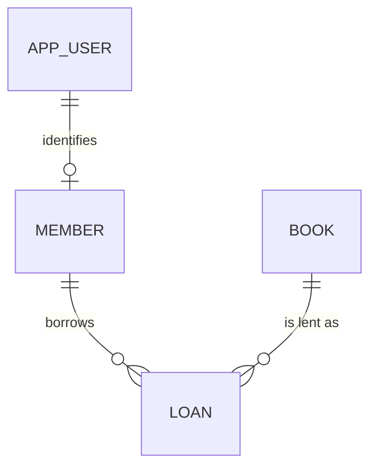

# Entity Model

Derived from [requirements.md](requirements.md) and the identity model in
[architecture.md](architecture.md).

## Entity Relationship Diagram

### APP_USER

> **External entity — not part of the domain model.** APP_USER is owned by the starter's
> security layer. The table is created by `V001__create_app_user.sql`, which ships with the
> project. No generated migration may recreate, alter, or drop it. The attribute table below
> is reference only, so that domain entities can be modelled against the real columns.

Holds authentication data only: the credentials and role a person signs in with (C-008).

| Attribute     | Description                            | Data Type | Length/Precision | Validation Rules                |
|---------------|----------------------------------------|-----------|------------------|---------------------------------|
| id            | Unique identifier                      | Long      | 19               | Primary Key, Sequence           |
| username      | Name the user signs in with            | String    | 60               | Not Null, Unique                |
| password_hash | BCrypt hash of the user's password     | String    | 120              | Not Null                        |
| role          | Access level granted to the user       | String    | 20               | Not Null, Values: MEMBER, LIBRARIAN |
| created_at    | Moment the account was created         | DateTime  | -                | Not Null                        |

### MEMBER

The library patron profile belonging to a person who borrows books.

| Attribute  | Description                             | Data Type | Length/Precision | Validation Rules                  |
|------------|-----------------------------------------|-----------|------------------|-----------------------------------|
| id         | Unique identifier                       | Long      | 19               | Primary Key, Sequence             |
| user_id    | Account this patron signs in with       | Long      | 19               | Not Null, Foreign Key (APP_USER.id) |
| name       | Full name of the patron                 | String    | 100              | Not Null                          |
| email      | Contact address of the patron           | String    | 255              | Not Null, Format: Email           |
| created_at | Moment the patron record was created    | DateTime  | -                | Not Null                          |

**Constraints:** user_id is unique — an APP_USER is linked to at most one MEMBER.

### BOOK

A title held by the library, together with the number of physical copies it owns.

| Attribute  | Description                                | Data Type | Length/Precision | Validation Rules          |
|------------|--------------------------------------------|-----------|------------------|---------------------------|
| id         | Unique identifier                          | Long      | 19               | Primary Key, Sequence     |
| title      | Title of the book                          | String    | 200              | Not Null                  |
| author     | Author of the book                         | String    | 150              | Not Null                  |
| isbn       | International Standard Book Number         | String    | 20               | Optional                  |
| copies     | Total number of physical copies held       | Integer   | 10               | Not Null, Min: 1, Max: 999 |
| created_at | Moment the book was added to the catalog   | DateTime  | -                | Not Null                  |

**Constraints:** Available copies are derived as copies minus the number of open LOAN rows and are never stored (C-018). The number of open loans for a book must never exceed copies. A book may only be removed when it has no open loans.

### LOAN

A record of one copy of a book being taken out by a patron and later brought back.

| Attribute   | Description                              | Data Type | Length/Precision | Validation Rules                  |
|-------------|------------------------------------------|-----------|------------------|-----------------------------------|
| id          | Unique identifier                        | Long      | 19               | Primary Key, Sequence             |
| member_id   | Patron who took the book out             | Long      | 19               | Not Null, Foreign Key (MEMBER.id) |
| book_id     | Book that was taken out                  | Long      | 19               | Not Null, Foreign Key (BOOK.id)   |
| borrowed_at | Moment the copy was taken out            | DateTime  | -                | Not Null                          |
| returned_at | Moment the copy was brought back         | DateTime  | -                | Optional                          |

**Constraints:** A loan is open while returned_at is null. returned_at must be later than borrowed_at. A loan carries no due date (C-019). Loans reference MEMBER.id, never APP_USER.id (C-009), and are retained for at least 24 months after return (NFR-014).

## Open Points

- **Borrow limit.** No maximum number of open loans per MEMBER is modelled, pending open
  question 1 in the requirements catalog.
- **isbn.** Modelled as optional because the catalog may hold older books without an ISBN.
  Whether it is searchable is open question 2 in the requirements catalog.
